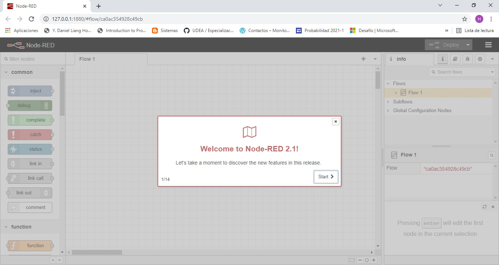
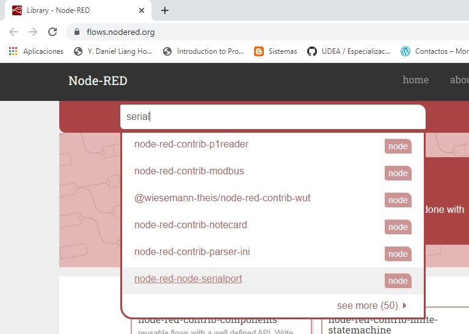
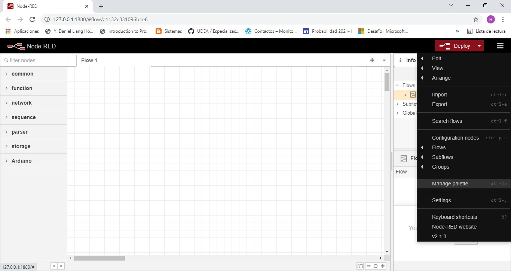
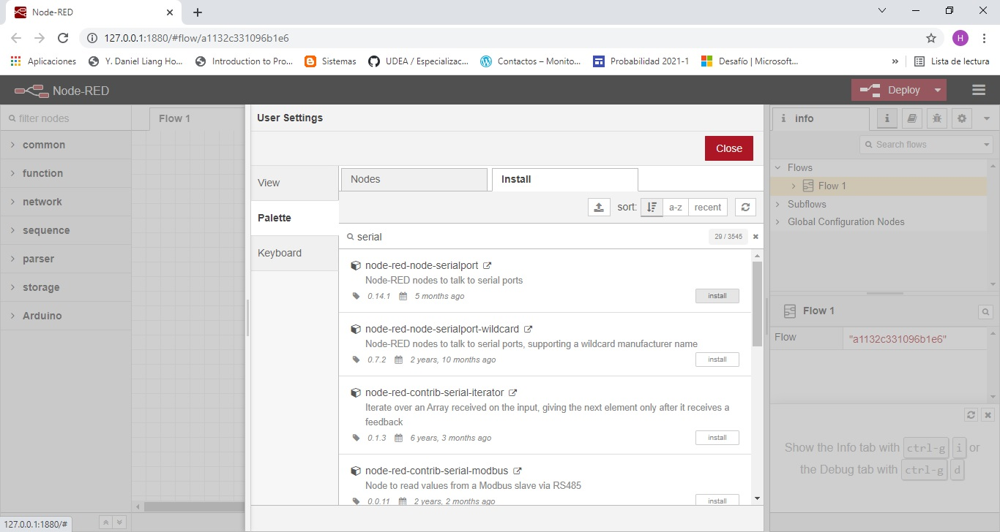
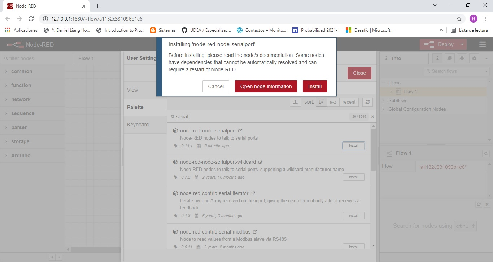
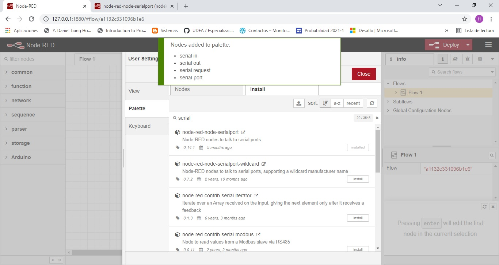
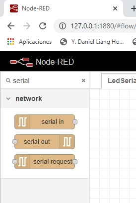

# Introducción al manejo de Node-RED

A continuación se describen los pasos basicos para poner en marcha el node-Red

## Instalación

Las instrucciones de instalación de node-RED se encuentran disponibles en la sección [documentación](https://nodered.org/docs/) de la herramienta. Mas especificamente, el proceso de instalación de instalación en windows se describe en el siguiente [link](https://nodered.org/docs/getting-started/windows#quick-start). A continuación se resume este procedimiento:
1. **Instalar Node.js**: Descargar el Node.js de la pagina oficial [https://nodejs.org/en/](https://nodejs.org/en/). Una vez hecho esto procesa a realizar la instalación siguiendo las instrucciones indicadas por el instalador.

Una vez que la instalación halla culminado, verificar que este correcta digitando en la terminal el comando:

```
node -v
```

2. **Instalar el Node-RED**: Una vez que haya instalado el Node.js correctamente, proceda a ejecutar el siguiente comando en la terminal para instalar el Node-RED:

```
npm install -g --unsafe-perm node-red
```

3. **Ejecute el Node-RED**: Una vez que se haya instalado el Node-RED, el siguiente paso consiste en ejecutarlo para lo cual se debe ejecutar el siguiente comando en la terminal:

```
node-red
```

Como la editor de Node-RED se ejecuta en el browser, se debe colocar la dirección http://127.0.0.1:1880 para acceder a esta y poder asi usarla tal y como se muestra en la siguiente figura:



## Agregando grupos de nodos

Una vez se ha instalado el Node-RED el siguiente paso consiste en agregar las librerias necesarias para desarrollar los proyectos. Existen tres formas para esto tal y como se describe en [Adding nodes to the palette](https://nodered.org/docs/user-guide/runtime/adding-nodes). Para nuestro caso especifico vamos a realizar el procedimiento de agregar librerias a traves del [Palette Manager](https://nodered.org/docs/user-guide/editor/palette/manager). 

Para nuestro caso supongamos que deseamos instalar los nodos asociados a la conexión serial. Lo primero que debemos hacer es buscar la libreria asociada a estos en [Node-RED Library](https://flows.nodered.org/) e introducir en el cuadro de busqueda la libreria a instalar:



Alli, seleccionamos la libreria **node-red-node-serialport** y observamos la información sobre esta [link](https://flows.nodered.org/node/node-red-node-serialport) para verificar si es la que necesitamos. 

Si es asi procedemos a instalar esta libreria a traves de la paleta siguiendo los siguientes pasos:

1. Acceda al **Palette Manager**: Para ello seleccione el icono de las **tres barras** al lado del boton de **Deploy** (esquina superior derecha) y luego seleccione el menú **Manage palette**:


   
2. **Proceda a instalar la libreria**: Recordemos que en nuestro caso deseamos instalar la libreria **node-red-node-serialport** de modo que en la ventana desplegada seleccionamos la pestaña **Install**:



Luego colocamos el nombre de la libreria a buscar y procedemos a seleccionar la libreria (**node-red-node-serialport** ) que deseamos instalar de las diferentes opciones que aparecen y presionamos el boton **Install**:



Como se muestra en la figura anterior, se despliega una ventana que informa la operación que esta por ser llevada a cabo. Una vez leido y entendido el procedimiento, procedemos a presional el boton rojo **Install**. Si todo sale bien, aparecera el siguiente mensaje:



3. **Comprobar que se han agregado los nodos de la libreria**: Una vez se haya instalado la libreria, es necesario verificar que los nodos asociados a esta se encuentran disponibles, para ellos en la paleta de nodos (ubicada a la izquierda) colocamos como filtro **serial** y verificamos que aparezcan los nodos asociados a la libreria:



Un tutorial muy bueno para profundizar y cacharrear en el manejo de Node-RED se encuentra en la pagina: http://noderedguide.com/. Asi mismo, el siguiente enlace tambien contiene información de bastante utilidad: https://knolleary.net/node-red-workshop-photobooth/


Antes de continuar, desarrolle la siguiente actividad.

### Actividad

Instalar la libreria **node-red-dashboard** y verificar que esta se muestre.

## Primeros ejemplos de prueba

A continuación se van a realizar dos ejemplos en los cuales se va a mostrar como se puede comunicar serialmente un modulo NodeMCU con Node-RED.


## Referencias

1. https://knolleary.net/node-red-workshop-photobooth/
2. https://nodered.org/docs/faq/interacting-with-arduino
3. http://support.elmark.com.pl/advantech/icom/routery/moduly_uzytkownika/Node.js/node-red-application-note-20200618.pdf
4. https://knolleary.net/node-red-workshop-photobooth/pdf/node-red-workshop-photobooth.pdf
5. https://www.snap4city.org/download/video/Node-RED_dashboard_user_manual.pdf
6. https://tech.ebu.ch/docs/events/opensource17/presentations/Streampunk.pdf
7. https://developer.cisco.com/meraki/build/node-red-getting-started-with-cisco-meraki-apis/
8. https://ibmcloud-watson-day.mybluemix.net/files/Lab.Node-RED-SocialDashboard.pdf
   
   