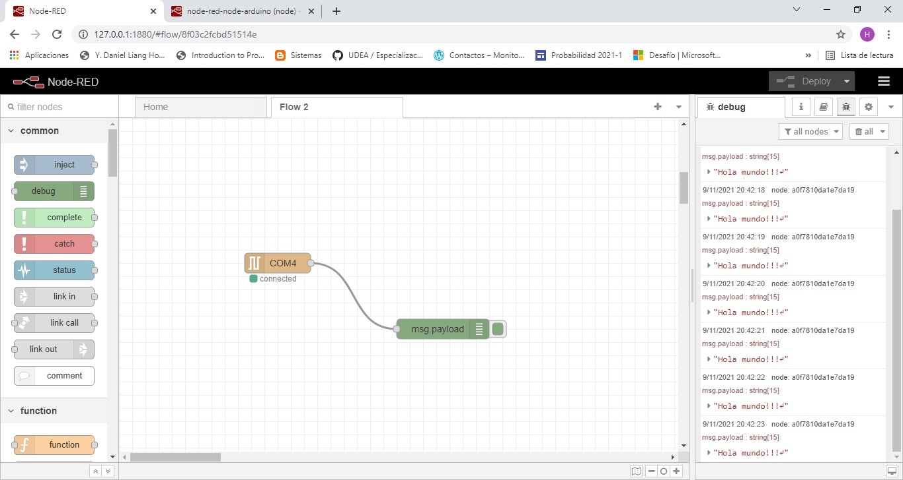

## Ejemplo 1

Nota: Para este caso el NodeMCU se conecto en el puerto COM4.

### Flujos



### Archivo JSON del flujo

```JSON
[
    {
        "id": "8f03c2fcbd51514e",
        "type": "tab",
        "label": "Flow 2",
        "disabled": false,
        "info": "",
        "env": []
    },
    {
        "id": "4223f9a6022ad425",
        "type": "serial in",
        "z": "8f03c2fcbd51514e",
        "name": "",
        "serial": "2d788a5279b4022f",
        "x": 240,
        "y": 920,
        "wires": [
            [
                "a0f7810da1e7da19"
            ]
        ]
    },
    {
        "id": "a0f7810da1e7da19",
        "type": "debug",
        "z": "8f03c2fcbd51514e",
        "name": "",
        "active": false,
        "tosidebar": true,
        "console": false,
        "tostatus": false,
        "complete": "false",
        "statusVal": "",
        "statusType": "auto",
        "x": 490,
        "y": 1020,
        "wires": []
    },
    {
        "id": "2d788a5279b4022f",
        "type": "serial-port",
        "serialport": "COM4",
        "serialbaud": "9600",
        "databits": "8",
        "parity": "none",
        "stopbits": "1",
        "waitfor": "",
        "dtr": "none",
        "rts": "none",
        "cts": "none",
        "dsr": "none",
        "newline": "\\n",
        "bin": "false",
        "out": "char",
        "addchar": "",
        "responsetimeout": "10000"
    }
]
```

## Circuito

Dibujar el circuito en Fritzing

## Codigo

```C++
void setup() {
  // El LED integrado está conectado al pin 2.
  Serial.begin(9600);
}

void loop() {
  Serial.println("Hola mundo!!!");
  delay(1000);
}
```

