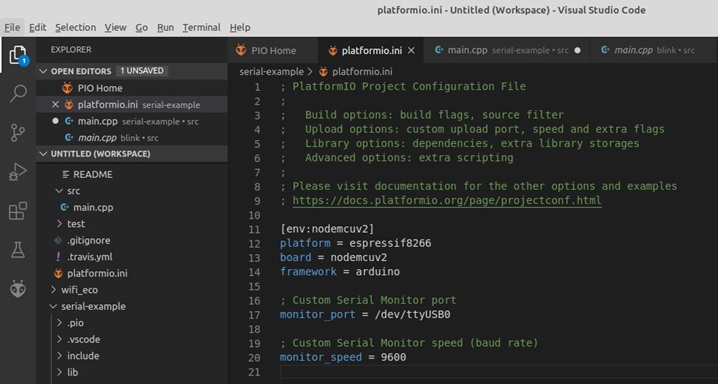

# Trabajando con Platformio

## Sobre Platformio

Es una cross-platform, cross-architecture, multiple framework que permite el desarrollo de aplicaciones para sistemas embebidos. La mayor ventaja de esto es que la herramienta permite que el programador pueda trabajar con diferentes plataformas (arduino, esp8266, rPi, etc.) usando el mismo IDE siguiendo el siguiente ciclo de desarrollo:
1.	Seleccionar la board(s) de interés en el archivo platformio.ini (Project Configuration File).
2.	Basado en la lista de boards, PlatformIO descargará las toolchains y las instalará automaticamente.
3.	Programar, compilar, preparar y subir la aplicación a las boards de interés.

## Instalación

Existe muy buena documentación sobre cómo llevar a cabo la instalación de platformio la cual se encuentra en https://platformio.org/install. Por lo tanto esta sección lo único que hicimos fue dedicarnos a copiar y pegar lo que allí se explica.
1.	[Descargar](https://code.visualstudio.com/) el Microsoft Visual Studio Code pues el PlatformIO IDE está construido sobre este.
2.	Abrir el VSCode Package Manager
3.	Buscar la extensión oficial del platformio ide
4.	Instalar el PlatformIO IDE.


## Trabajando con Platformio

En el siguiente [enlace](https://docs.platformio.org/en/latest/integration/ide/vscode.html#quick-start) se muestra una guía rápida para trabajar con platformio. Como esta guia esta enfocada en el arduino, vamos a seguir el tutorial **Quick start with NodeMCU v3 (ESP8266) , Arduino ecosystem and PlatformIO IDE** ([enlace](https://loginov-rocks.medium.com/quick-start-with-nodemcu-v3-esp8266-arduino-ecosystem-and-platformio-ide-b8415bf9a038)) en el cual se explica cómo programar el NodeMCU usando platformio. Veamos los pasos a continuación:
1.	Ubicarse en el home de platformio:


2.	Crear un nuevo proyecto (**New project**) y configurarlo, para el caso:
    * **Name**: blink
    * **Board**: NodeMCU 1.0 (ESP-12E Module)
    * **Framework**: Arduino.

    Luego de esto se da click en **finish**.


**Nota**: Si lo que se desea es usar otra localización diferente a la que viene por defecto, se puede deseleccionar la casilla de Location que define esto y se procede a seleccionar la ruta.

3. Una vez se da **finish**, si todo está bien se descargan las dependencias y se construye la estructura del proyecto. Dentro de los archivos generados se encuentra el archivo de configuración del proyecto **platformio.ini** (para más información sobre puede consultar el siguiente [enlace](https://docs.platformio.org/en/latest/projectconf/)). A continuación se muestra el archivo de configuración, generado para nuestro ejemplo:


Otro archivo de importancia generado es el archivo ```main.cpp``` (esta se encuentra en el directorio ```src```) el cual contiene la plantilla del código fuente que modificaremos para definir la lógica de nuestra aplicación:


Para el caso, lo que deseamos hacer que parpadee el led que viene integrado con la tarjeta del NodeMCU con un periodo de un segundo. A continuación, se muestran los pines del NodeMCU. Para el caso, el pin asociado al led integrado en la tarjeta es el **GPIO2**.


De este modo, el programa a subir a la tarjeta será el siguiente:

```C
#include <Arduino.h>

#define LED 2   // Assign LED to pin GPIO2 (Built-in LED)

void setup() {
  // put your setup code here, to run once:
  pinMode(LED, OUTPUT);
}

void loop() {
  // put your main code here, to run repeatedly:
  digitalWrite(LED, LOW);
  delay(500);
  digitalWrite(LED, HIGH);
  delay(1000);
}
```

Así el código modificado quedará:


4. Finalmente, solo resta hacer el build y el upload empleando los botones destinados para ello. La siguiente figura muestra como hacer el **build** (```CTRL + ALT + b```):


La siguiente figura muestra como hacer el **upload** (```CTRL + ALT + u```):


Si el proceso de upload (carga del programa en la plataforma) está bien, saldrá en la terminal algo como lo siguiente:


5. Finalmente una vez cargado el programa, se verá el led titilando.


## Casos de interes

A continuación, se analizarán dos casos que son muy comunes en muchas de las aplicaciones que se harán a lo largo del curso:
1.	Uso del puerto serial.
2.	Uso del wifi.

### Uso del puerto serial

Para tratar este caso, partamos del siguiente problema. 

**Problema**: Hacer una aplicación en arduino que permita prender y apagar el led integrado a la tarjeta NodeMCU mediante las instrucciones mostradas en la siguiente tabla: 

|Comando|Efecto|
|---|---|
|```h```|Enciende el led|
|```l```|Apaga el led|

La codificación del procedimiento es similar a la realizada en el ejemplo anterior, pero, en este caso el código fuente a codificar se muestra a continuación, se muestra a continuación:

```C
#include <Arduino.h>

#define LED 2   // Assign LED to pin GPIO2 (Built-in LED)

byte comando;

void setup() {
  // initialize serial communication at 9600 bits per second:
  Serial.begin(9600);
  Serial.write("Configurando puerto serial a 9600bps\n");
  // initialize digital pin LED as an output.
  pinMode(LED, OUTPUT);
}

void loop() {
  // check if data has been sent from the computer
  if (Serial.available()) {
    // read the most recent byte 
    comando = Serial.read();
    if(comando == 'h') {
      digitalWrite(LED, HIGH);
      Serial.write("Led encendido\n");
    }
    else if(comando == 'l') {
      digitalWrite(LED, LOW);
      Serial.write("Led apagado\n");
    }
  } 
}
```

Es buena práctica que una vez codificado el código, este sea construido (```CTRL + ALT + b``` en linux) antes de que sea subido a la plataforma. 

La importancia de este problema radica en que se va a hacer uso del puerto serial, por lo que es necesario agregar las líneas para configurar el puerto serial en el archivo **platformio.ini**. Inicialmente, es bueno verificar cual es el puerto serial al que quedó asignado el NodeMCU una vez que este fue conectado lo cual depende del sistema operativo ([link](https://la.mathworks.com/help/supportpkg/arduinoio/ug/find-arduino-port-on-windows-mac-and-linux.html)). 

El puerto USB que aparezca al realizar la verificación, es aquel que está conectado el NodeMCU (supongamos que el resultado dio ttyUSB0). 

Inicialmente si abrimos el archivo platformio.ini tendremos algo como lo siguiente:

```ini
; PlatformIO Project Configuration File
;
;   Build options: build flags, source filter
;   Upload options: custom upload port, speed and extra flags
;   Library options: dependencies, extra library storages
;   Advanced options: extra scripting
;
; Please visit documentation for the other options and examples
; https://docs.platformio.org/page/projectconf.html

[env:nodemcuv2]
platform = espressif8266
board = nodemcuv2
framework = arduino
```

Teniendo en cuenta que el puerto de trabajo será el ```ttyUSB0``` (para este ejemplo) y la velocidad serial será de 9800 bps. Se agregaron las siguientes líneas en el archivo de configuración (para más información de como configurar el monitor serial puede consultar el enlace [Monitor Options](https://docs.platformio.org/en/latest/projectconf/section_env_monitor.html)):


```ini
; PlatformIO Project Configuration File
;
;   Build options: build flags, source filter
;   Upload options: custom upload port, speed and extra flags
;   Library options: dependencies, extra library storages
;   Advanced options: extra scripting
;
; Please visit documentation for the other options and examples
; https://docs.platformio.org/page/projectconf.html

[env:nodemcuv2]
platform = espressif8266
board = nodemcuv2
framework = arduino

; Custom Serial Monitor port
monitor_port = /dev/ttyUSB0

; Custom Serial Monitor speed (baud rate)
monitor_speed = 9600
```

De este modo el archivo platformio.ini queda así:



Una vez hecho esto, el paso siguiente consistirá en subir el código al NodeMCU (```CTRL + ALT + u``` en linux). 

De este modo solo resta probar en el monitor serial, para ello se da click en el botón resaltado (o se ejecuta la combinación de teclas ```CTRL + ALT + s```) en la siguiente figura:


Finalmente, una vez llamado el monitor serial, se hace un reset del NodeMCU y se ejecuta la aplicación de acuerdo a la lógica programada:


 Cuando culmine la prueba con la combinación de letras ```CTRL + C``` puede salir del monitor serial. 

 